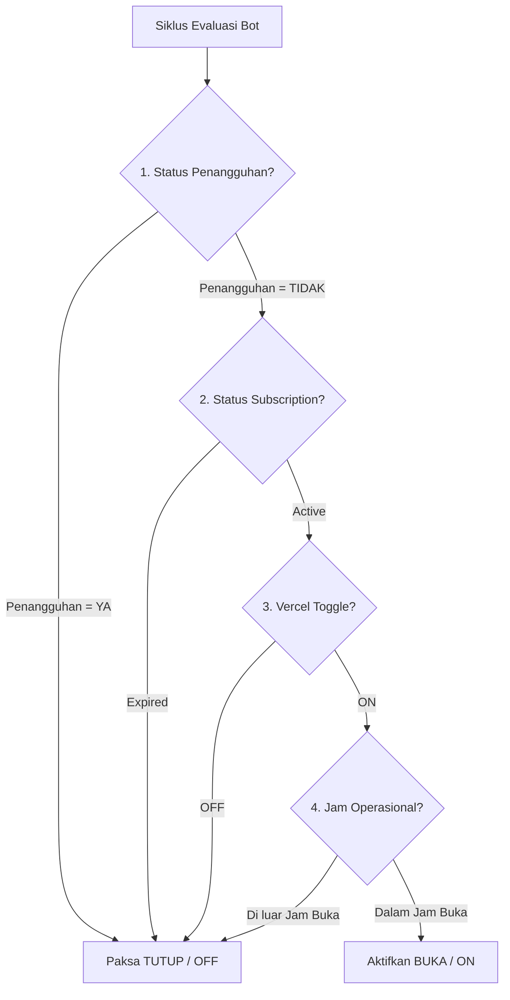

# Auto-OC (Superfood Automation Suite)

[](https://www.python.org/)
[](https://fastapi.tiangolo.com/)
[](https://reactjs.org/)
[](https://www.docker.com/)

**Auto-OC** adalah platform otomatisasi **Auto Open & Auto Close** untuk outlet **ShopeeFood (ShopeePartner)**. Sistem ini bekerja secara otomatis mengevaluasi status outlet secara real-time berdasarkan **Vercel Toggle** sebagai *Source of Truth*, **Status Penangguhan**, **Status Subscription**, dan **Jam Operasional Outlet**.

---

## 🎯 Prioritas Keputusan Sistem (System Priority Enforcement)

Setiap siklus eksekusi bot mengevaluasi status outlet secara hierarkis mengikuti urutan prioritas berikut:



1. **Status Penangguhan**: Jika outlet ditangguhkan (Penangguhan = Ya) $\rightarrow$ **Paksa TUTUP (OFF)**.
2. **Status Subscription**: Jika status langganan kadaluarsa $\rightarrow$ **Nonaktifkan Auto Open**.
3. **Vercel Toggle**: Source of Truth utama (ON / OFF) dari Vercel API / Google Sheets.
4. **Jam Operasional**: Jika di luar jam operasional $\rightarrow$ **TUTUP (OFF)**.
5. **ShopeePartner Toggle**: Status aktual outlet di portal Shopee Partner.

---

## ✨ Fitur Utama

- 🤖 **Automated Engine & Unified Service**:
  - Mengatur toko secara otomatis (Buka / Tutup Sementara) pada portal ShopeePartner.
  - REST API Server & Bot Scheduler terintegrasi secara bersamaan dalam 1 proses tunggal di **Port 8000**.
  - Pre-evaluation auto-sync jam operasional langsung dari API Shopee Partner.
  - Penanganan sesi browser terisolasi (`chromeprofile/`) dan headless mode (Raspberry Pi 5 / Server).
- 📊 **Unified Data Provider**:
  - Integrasi Published Google Sheets CSV URL sebagai basis data outlet.
  - Perhitungan otomatis status *Subscription (Active / Expired)* secara dinamis.
  - Caching dan backup lokal berbasis **SQLite Database** (`data/db/auto_oc.db`).
- 🌐 **FastAPI Backend & Web Dashboard (React + Vite)**:
  - Dashboard Web interaktif dengan tema dark-mode & glassmorphism.
  - **Merchant Multi-Store Access**: Otentikasi token (`/login?token=...`) berbasis Merchant ID untuk akses toko terkelola.
  - **Admin Panel**: Kontrol master jam operasional 7 hari, jam khusus Jumat/Weekend, dan generator link merchant.
  - **Real-Time Polling & Live Badge**: Pembaruan status outlet secara otomatis dan indikator status bot berjalan.
- 🐳 **Docker Containerization & Cross-Platform**:
  - Dukungan Docker (`Dockerfile`, `docker-compose.yml`, `./deploy_docker.sh`).
  - Skrip installer otomatis untuk Linux/Raspberry Pi (`./setup.sh`).

---

## 📂 Struktur Proyek

```
Auto-OC/
├── api_server.py                  # Unified REST API Server & Auto-OC Bot Scheduler (Port 8000)
├── run.py                         # Interactive CLI Runner
├── setup.sh                       # Installer otomatis Linux/Raspberry Pi (uv)
├── deploy_docker.sh               # Skrip pembantu manajemen Docker
├── docker-compose.yml             # Konfigurasi Docker Compose
├── Dockerfile                     # Docker build definition (Headless Chromium)
├── requirements.txt               # Dependensi Python
├── 1. run_master.sh / .bat        # Startup script master runner
├── 2. run_force_open_scheduler.sh # Startup script force open scheduler
├── common/                        # Core Shared Utilities
│   ├── data_provider.py           # Unified Data Provider (Google Sheets / Vercel API)
│   └── db_manager.py              # SQLite Database Manager & Audit Log Engine
├── config/                        # File konfigurasi sistem
├── modules/                       # Automation Engine Modules
│   └── shopee/                    # Modul otomatisasi ShopeePartner
│       ├── main_runner.py         # Entry point runner Shopee
│       └── force_open/            # Force Open/Close logic & auto-sync
├── web/                           # Application Web Frontend (React + Vite)
│   ├── src/
│   │   ├── components/            # React Components (Admin, Merchant, Audit Logs, dll)
│   │   ├── utils/                 # Frontend helpers & utilities
│   │   └── App.jsx                # Main Application Container
│   └── package.json               # Dependensi Node.js & Vite config
└── chromeprofile/                 # Sesi browser terisolasi (Google Chrome profile)
```

---

## 🛠️ Instalasi & Persiapan

### 1. Prasyarat System
- **Python 3.10+**
- **Google Chrome** (untuk pengujian lokal) atau **Chromium Headless** (untuk Linux server/Pi)
- **Node.js 18+** & **npm** (untuk build Web Frontend)

### 2. Instalasi Otomatis (Linux / Raspberry Pi)
Jalankan skrip installer cepat menggunakan `uv`:

```bash
chmod +x setup.sh
./setup.sh
```

### 3. Konfigurasi Environment (`.env`)
Buat file `.env` pada direktori root proyek:

```ini
# Data Provider & Sheet Integration
SPREADSHEET_CSV_URL="https://docs.google.com/spreadsheets/d/e/.../pub?output=csv"
VERCEL_API_URL="https://your-vercel-domain.vercel.app/api"

# Server & Security
SECRET_TOKEN="your_secure_secret_token_here"
PORT=8000
HOST="0.0.0.0"

# Optional Webhooks
DISCORD_WEBHOOK_URL="https://discord.com/api/webhooks/..."
```

---

## 🚀 Cara Menjalankan

### A. Menjalankan Layanan Terpadu (Backend API + Bot Scheduler)

Cukup jalankan satu perintah:

```bash
python api_server.py
```

*Atau via CLI Runner:*
```bash
python run.py
# Pilih opsi "Start Unified Auto-OC Backend API & Bot Scheduler (Port 8000)"
```

### B. Menjalankan via Docker (Production)

```bash
# Menjalankan container di background
./deploy_docker.sh up

# Melihat log bot & API server
./deploy_docker.sh logs

# Menghentikan container
./deploy_docker.sh down
```

### C. Menjalankan Web Frontend

```bash
cd web
npm install
npm run dev
```
*Aplikasi Web Dashboard akan berjalan pada `http://localhost:5173` dan otomatis terhubung ke `http://localhost:8000`.*

---

## 📑 Logging & Audit Trail

Sistem menyimpan setiap tindakan bot (buka store, tutup store, skip/no action, retry, error) secara terstruktur pada **SQLite Database** (`data/db/auto_oc.db`) dan dapat dilihat melalui tab **Audit Logs** di Web Dashboard.

Format Log Minimum:
`[Timestamp] [Store ID / Outlet Name] [Penangguhan] [Subscription] [Vercel Toggle] [Shopee Status Sebelum] [Tindakan Bot] [Shopee Status Sesudah] [Status/Result]`

---

## 📜 Lisensi & Hak Cipta
Hak Cipta © 2026 **Superfood Tech**. Hak cipta dilindungi undang-undang.
